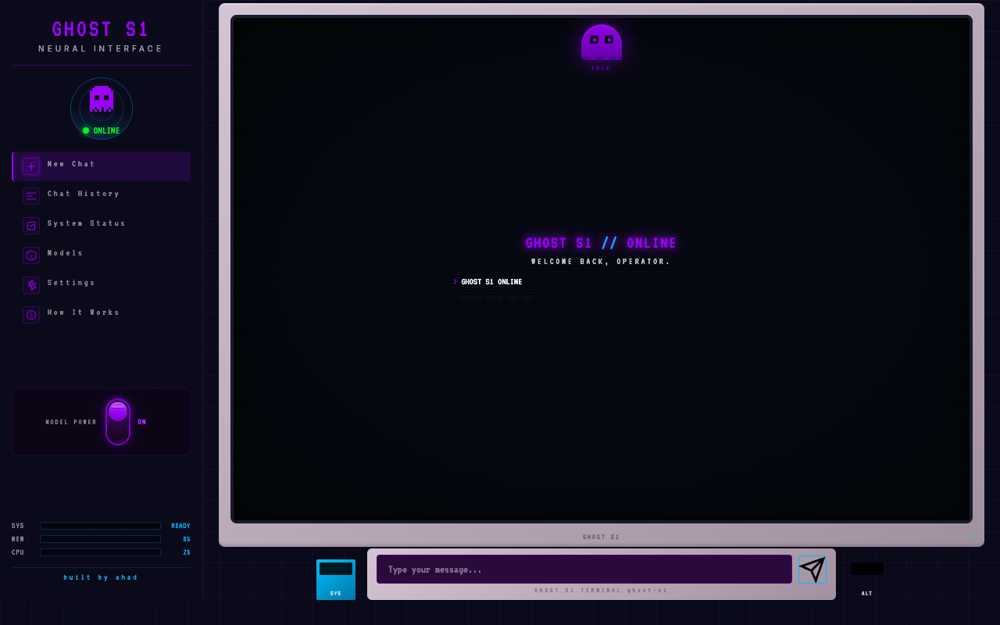

# Hi, I'm **Abdull Ahad Afrid** 🇧🇩

## 🚀 Software Builder | CS Student | Civic-Tech Founder

<h3 align="center">
C++ Systems • PHP Backend • React Frontend • AI-Augmented Development
</h3>

---

# 🧠 About Me

I'm a **23-year-old software builder** from Bangladesh, studying Computer Science at **Dong Eui University, Busan, South Korea**. I build practical digital tools that solve real problems.

I don't write perfect code on the first try. I write code that ships, then I make it better.

> **"Build fast, break things, fix them, ship again."**

My workflow is AI-augmented — I coordinate multiple coding agents (Hermes, Cursor, Kiro, Antygravity) to parallelize development and iterate faster.

---

# 📸 Project Showcase

### [deu-bank](https://github.com/AbdullAhad1/deu-bank) — React, TypeScript, Tailwind
Full-featured digital banking — biometric auth, live crypto, multi-currency, analytics, PWA

### [ghost-s1](https://github.com/AbdullAhad1/ghost-s1) — PHP, JavaScript, Ollama
Cyberpunk local LLM chat interface with custom personality

### [oop-shop](https://github.com/AbdullAhad1/oop-shop) — C++98
CLI online shop & inventory system with ANSI-styled terminal UI

### [deumemes](https://github.com/AbdullAhad1/deumemes) — PHP, MySQL
Social meme platform — posts, likes, comments, follows, profiles

### [snake-game](https://github.com/AbdullAhad1/snake-game) — JavaScript
Classic Snake with score tracking, speed levels, and retro arcade styling

---

# 🛠 Tech Stack

## Languages & Core

## Frontend

## Backend & Tools

## AI & Agent Stack

---

# 📈 GitHub Stats

  

---

# 🌱 Currently Learning

- **Agentic AI systems** — multi-agent orchestration, autonomous coding workflows
- **C++ systems programming** — building CLI tools with OOP principles
- **Financial tech** — personal finance automation, banking integrations
- **Korean language** — living and studying in Busan

---

# 📫 Connect

  

 

  

